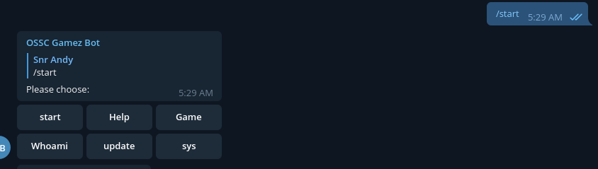

# Telegram Quiz Bot 

<div id="top"></div>

[![Contributors][contributors-shield]][contributors-url]
[![Forks][forks-shield]][forks-url]
[![Stargazers][stars-shield]][stars-url]
[![Issues][issues-shield]][issues-url]
[![MIT License][license-shield]][license-url]


<!-- PROJECT LOGO -->
<br />
<div align="center">
  <a href="https://github.com/andrew21-mch/tg-gamebot">
    
  </a>

<h3 align="center">project_title</h3>

  <p align="center">
    project_description
    <br />
    <a href="https://github.com/osscameroon/tg-gamebot"><strong>Explore the docs »</strong></a>
    <br />
    <br />
    <a href="https://github.com/osscameroon/tg-gamebot">View Demo</a>
    ·
    <a href="https://github.com/osscameroon/tg-gamebot/issues">Report Bug</a>
    ·
    <a href="https://github.com/osscameroon/tg-gamebot/issues">Request Feature</a>
  </p>
</div>


<!-- TABLE OF CONTENTS -->
<details>
  <summary>Table of Contents</summary>
  <ol>
    <li>
      <a href="#about-the-project">About The Project</a>
      <ul>
        <li><a href="#built-with">Built With</a></li>
      </ul>
    </li>
    <li>
      <a href="#getting-started">Getting Started</a>
      <ul>
        <li><a href="#prerequisites">Prerequisites</a></li>
        <li><a href="#installation">Installation</a></li>
      </ul>
    </li>
    <li><a href="#usage">Usage</a></li>
    <li><a href="#roadmap">Roadmap</a></li>
    <li><a href="#contributing">Contributing</a></li>
    <li><a href="#license">License</a></li>
    <li><a href="#contact">Contact</a></li>
    <li><a href="#acknowledgments">Acknowledgments</a></li>
  </ol>
</details>


<!-- ABOUT THE PROJECT -->
## About The Project

### Description
This bot will be seperate on modules...

- the question maker module (based on some inputs, external or internal)
- the publisher module (that will publish on any platform we have)
- the leaderboard module (that will get peoples response and evaluate that for corresponding quiz bots)

<p align="right">(<a href="#top">back to top</a>)</p>


### Built With

* [Python.py](https://python.org/)

<p align="right">(<a href="#top">back to top</a>)</p>


<!-- GETTING STARTED -->
## Getting Started

This is an example of how you may give instructions on setting up your project locally.
To get a local copy up and running follow these simple example steps.

### Prerequisites

This is an example of how to list things you need to use the software and how to install them.
* Python3
* Pip3
* python-telegram-bot


### Installation

1. Clone the repo
   ```sh
   git clone https://github.com/osscameroon/tg-gamebot.git
   ```
2. Install Python3
  ```
  sudo apt-get install python3
  ```
3. Install Pip3
  ```
    sudo apt install python3-pip
  ```
4. Install python-telegram-bot
  ```
  pip install python-telegram-bot
  ```
5. Install python-telegram bot
   ```sh
   pip3 install python-telegram-bot
   ```
6. Enter your API in `config.py`
   ```js
   const API_KEY = 'ENTER YOUR API';
   ```

<p align="right">(<a href="#top">back to top</a>)</p>


<!-- USAGE EXAMPLES -->
## Testing

- run with 
```
python3 main.py
```
- open telegram and try it out

<p align="right">(<a href="#top">back to top</a>)</p>


<!-- ROADMAP -->
## Roadmap

- [] question marker
- [] publish  Quiz
- [] Leaderboard
    - [] Nested Feature

See the [open issues](https://github.com/osscameroon/tg-gamebot/issues) for a full list of proposed features (and known issues).

<p align="right">(<a href="#top">back to top</a>)</p>


<!-- CONTRIBUTING -->
## Contributing

Contributions are what make the open source community such an amazing place to learn, inspire, and create. Any contributions you mexampleake are **greatly appreciated**.

If you have a suggestion that would make this better, please fork the repo and create a pull request. You can also simply open an issue with the tag "enhancement".
Don't forget to give the project a star! Thanks again!

1. Fork the Project
2. Create your Feature Branch (`git checkout -b feature/AmazingFeature`)
3. Commit your Changes (`git commit -m 'Add some AmazingFeature'`)
4. Push to the Branch (`git push origin feature/AmazingFeature`)
5. Open a Pull Request

<p align="right">(<a href="#top">back to top</a>)</p>


<!-- LICENSE -->
## License

Distributed under the MIT License. See `LICENSE.txt` for more information.

<p align="right">(<a href="#top">back to top</a>)</p>


<!-- CONTACT -->
## Contact

Your Name - [@twitter_handle](https://twitter.com/twitter_handle) - email@email_client.com

Project Link: [https://github.com/osscameroon/tg-gamebot](https://github.com/osscameroon/tg-gamebot)

<p align="right">(<a href="#top">back to top</a>)</p>


<!-- ACKNOWLEDGMENTS -->
## Acknowledgments

* []()
* []()
* []()

<p align="right">(<a href="#top">back to top</a>)</p>


<!-- MARKDOWN LINKS & IMAGES -->
<!-- https://www.markdownguide.org/basic-syntax/#reference-style-links -->
[contributors-shield]: https://img.shields.io/github/contributors/github_username/repo_name.svg?style=for-the-badge
[contributors-url]: https://github.com/osscameroon/tg-gamebot/graphs/contributors
[forks-shield]: https://img.shields.io/github/forks/github_username/repo_name.svg?style=for-the-badge
[forks-url]: https://github.com/osscameroon/tg-gamebot/network/members
[stars-shield]: https://img.shields.io/github/stars/github_username/repo_name.svg?style=for-the-badge
[stars-url]: https://github.com/osscameroon/tg-gamebot/stargazers
[issues-shield]: https://img.shields.io/github/issues/github_username/repo_name.svg?style=for-the-badge
[issues-url]: https://github.com/osscameroon/tg-gamebot//issues
[license-shield]: https://img.shields.io/github/license/github_username/repo_name.svg?style=for-the-badge
[license-url]: https://github.com/github_username/repo_name/blob/master/LICENSE.txt
[linkedin-shield]: https://img.shields.io/badge/-LinkedIn-black.svg?style=for-the-badge&logo=linkedin&colorB=555